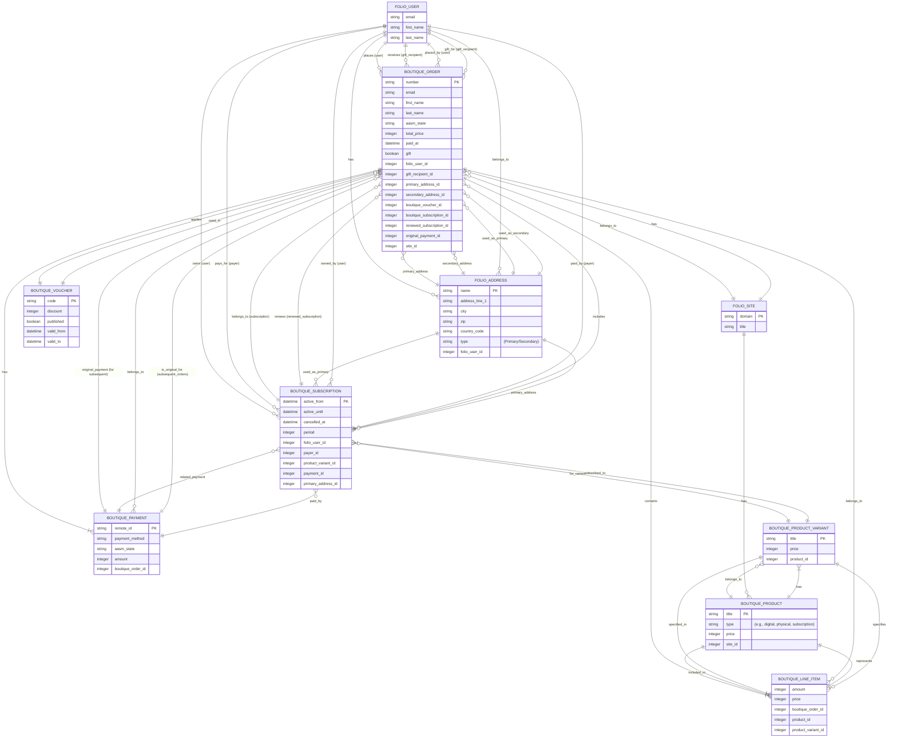
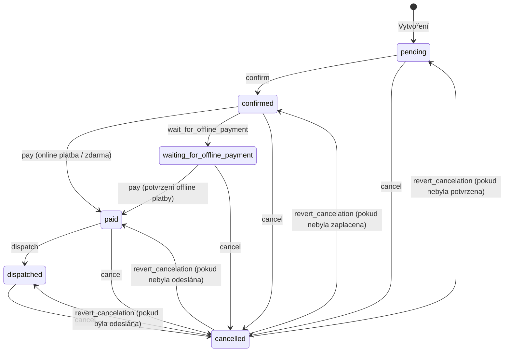
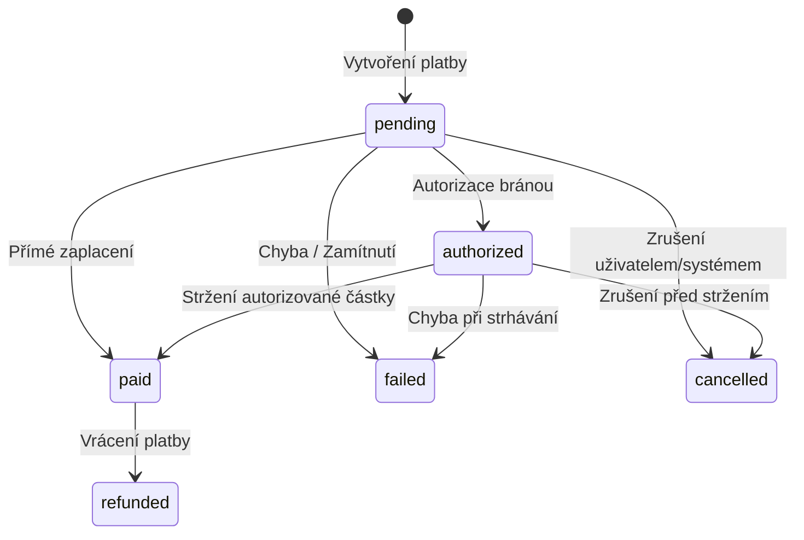

# Boutique - Specifikace Datového Modelu a Konceptů

## 1. Úvod

Tento dokument popisuje datový model a klíčové koncepty e-commerce platformy Boutique. Slouží jako základ pro pochopení entit, jejich vztahů a základní business logiky. Je východiskem pro další revizi a rozvoj.

## 2. Klíčové Koncepty

### 2.1. Jednorázový Nákup vs. Předplatné

Systém Boutique podporuje dva základní modely prodeje: jednorázové nákupy a předplatné. Rozlišení mezi nimi má dopad na více částí systému:

*   **Objednávky (`Boutique::Order`):**
    *   **Jednorázový nákup:** Zákazník vytvoří jednu objednávku, která projde standardním životním cyklem (potvrzení, platba, odeslání/vyřízení).
    *   **Předplatné:** Vytváří se:
        1.  *Počáteční objednávka:* Zákazník zakoupí produkt typu předplatné. Tato objednávka založí záznam `Boutique::Subscription`.
        2.  *Následné (obnovovací) objednávky:* Systém automaticky generuje nové objednávky v pravidelných intervalech (dle periody předplatného) pro jeho obnovení. Tyto objednávky jsou propojeny s původní platbou (`original_payment_id`) a existujícím předplatným (`boutique_subscription_id`, `renewed_subscription_id`). Jejich úspěšné zaplacení prodlužuje platnost záznamu `Boutique::Subscription`.

*   **Platby (`Boutique::Payment`):**
    *   **Jednorázový nákup:** K objednávce se váže jedna nebo více platebních pokusů, dokud není dosaženo stavu `paid` (nebo `failed`/`cancelled`).
    *   **Předplatné:**
        1.  *Počáteční platba:* Platba za první objednávku často slouží k autorizaci opakovaných plateb (tokenizace karty, souhlas s recurrentní platbou). ID této platby se ukládá do následných objednávek jako `original_payment_id`.
        2.  *Opakované platby:* U automaticky generovaných obnovovacích objednávek se systém pokusí strhnout platbu pomocí uložené platební metody navázané na `original_payment`. Selhání opakované platby může vést k pozastavení nebo zrušení předplatného.

*   **Položky Objednávky (`Boutique::LineItem`):**
    *   **Jednorázový nákup:** Položka reprezentuje konkrétní produkt nebo variantu zakoupenou v daném množství a za cenu platnou v okamžiku objednání.
    *   **Předplatné:** Položka v *počáteční* objednávce reprezentuje zakoupení samotného předplatného (např. "Roční předplatné časopisu X"). Často obsahuje příznaky jako `subscription_recurring` (zda se má automaticky obnovovat) a `subscription_starts_at` (odkdy má běžet). Položky v *obnovovacích* objednávkách pak reprezentují úhradu za další období daného předplatného.

*   **Produktový Design (`Boutique::Product`, `Boutique::ProductVariant`):**
    *   **Jednorázový nákup:** Produkt je obvykle typu `Boutique::Product::Digital` nebo `Boutique::Product::Physical`. Nemá specifické atributy pro předplatné.
    *   **Předplatné:** Produkt musí být typu `Boutique::Product::Subscription`. Musí mít definované atributy jako `subscription_period` (délka periody v měsících) a `subscription_recurring` (zda je ve výchozím stavu opakované). Může mít i `subscription_frequency_in_issues_per_year` (pro výpočet dopravy u fyzických předplatných). Často je konkrétní plán předplatného definován pomocí `Boutique::ProductVariant` (např. Měsíční vs. Roční).

*   **Distribuce / Vyřízení:**
    *   **Jednorázový nákup:** Vyřízení (odeslání fyzického zboží, zpřístupnění digitálního obsahu) probíhá jednou po úspěšném zaplacení objednávky (přechod do stavu `dispatched`).
    *   **Předplatné:** Vyřízení probíhá opakovaně. Po zaplacení *každé* (počáteční i obnovovací) objednávky dochází k akci – typicky prodloužení přístupu ke službě (`active_until` v `Subscription`) nebo zařazení do expedice pro další vydání/zásilku v daném období.

## 3. Datový Model

### 3.1. ER Diagram

Následující diagram znázorňuje hlavní datové modely a jejich propojení.

*Poznámka: Modely `Folio::User`, `Folio::Address` a `Folio::Site` jsou pravděpodobně součástí core engine `Folio` a Boutique je rozšiřuje nebo využívá.*
*Diagram zobrazuje klíčové atributy a primární/cizí klíče (PK/FK) pro lepší přehled.*

### 3.2. Popis Klíčových Modelů

Zde je podrobnější vysvětlení účelu, role a atributů jednotlivých klíčových modelů v systému Boutique:

#### 3.2.1. Boutique::Order

**Popis:**
Základní kámen celého nákupního procesu. `Order` představuje kompletní záznam o tom, co si zákazník objednal, za jakou cenu, kam to má být doručeno (nebo jak zpřístupněno u digitálních produktů), jaký je stav vyřízení (od vytvoření v košíku až po odeslání/zrušení) a jak bylo zaplaceno. Uchovává všechny důležité informace pohromadě – údaje o zákazníkovi (nebo obdarovaném, pokud jde o dárek), seznam objednaných položek (`LineItem`), výslednou cenu včetně slev a dopravy, použitý slevový kupón (`Voucher`), informace o platbě (`Payment`), doručovací a fakturační adresu (`Address`). Pokud je součástí objednávky předplatné, je zde i propojení na něj (`Subscription`). Každá objednávka dostává unikátní, pro zákazníka srozumitelné číslo.

**Klíčové Atributy:**

- **`number` (Číslo objednávky):** Unikátní identifikátor objednávky viditelný pro zákazníka i administrátora (např. `2300001`).
- **`base_number` (Základní číslo):** Interní sekvenční číslo, ze kterého se odvozuje `number` (často s prefixem roku).
- **`email`:** Kontaktní email zákazníka pro danou objednávku.
- **`first_name` (Jméno):** Křestní jméno zákazníka.
- **`last_name` (Příjmení):** Příjmení zákazníka.
- **`aasm_state` (Stav):** Aktuální stav objednávky v procesu zpracování. Může nabývat hodnot:
    - `pending` (Čekající): Objednávka byla vytvořena v košíku, ale ještě nebyla potvrzena.
    - `confirmed` (Potvrzená): Zákazník potvrdil objednávku, čeká se na platbu (nebo je zdarma).
    - `waiting_for_offline_payment` (Čeká na offline platbu): U plateb, které nejsou okamžité (např. bankovní převod).
    - `paid` (Zaplacená): Platba byla úspěšně přijata.
    - `dispatched` (Odeslaná/Vyřízená): Zboží bylo odesláno nebo digitální produkt/přístup zpřístupněn.
    - `cancelled` (Zrušená): Objednávka byla zrušena.
- **`total_price` (Celková cena):** Finální cena objednávky po započtení slev a dopravy.
- **`line_items_price` (Cena položek):** Součet cen všech položek v objednávce před slevou a dopravou.
- **`shipping_price` (Cena dopravy):** Náklady na dopravu.
- **`discount` (Sleva):** Celková výše slevy aplikovaná na objednávku (obvykle z voucheru).
- **`voucher_code` (Kód voucheru):** Kód použitého slevového voucheru.
- **`paid_at` (Zaplaceno dne):** Datum a čas, kdy byla objednávka zaplacena.
- **`confirmed_at` (Potvrzeno dne):** Datum a čas, kdy zákazník potvrdil objednávku.
- **`dispatched_at` (Odesláno dne):** Datum a čas, kdy byla objednávka odeslána/vyřízena.
- **`cancelled_at` (Zrušeno dne):** Datum a čas, kdy byla objednávka zrušena.
- **`gift` (Dárek):** Označuje, zda je objednávka dárkem pro někoho jiného.
- **`gift_recipient_email` (Email obdarovaného):** Email osoby, pro kterou je dárek určen.
- **`gift_recipient_first_name` (Jméno obdarovaného):** Křestní jméno obdarovaného.
- **`gift_recipient_last_name` (Příjmení obdarovaného):** Příjmení obdarovaného.
- **`gift_recipient_notification_scheduled_for` (Naplánované oznámení dárku):** Datum a čas, kdy má být obdarovanému odesláno oznámení o dárku.
- **`gift_recipient_notification_sent_at` (Oznámení dárku odesláno):** Datum a čas, kdy bylo oznámení skutečně odesláno.
- **`invoice_number` (Číslo faktury):** Číslo daňového dokladu (faktury) vygenerovaného k objednávce.
- **`use_secondary_address` (Použít druhou adresu):** Příznak, zda se má pro fakturaci použít sekundární (fakturační) adresa místo primární (doručovací).

**Vztahy (Propojení):**

- **`folio_user_id` -> `Folio::User`:** Propojení na zákazníka, který objednávku vytvořil.
- **`gift_recipient_id` -> `Folio::User`:** Propojení na uživatele, který je příjemcem dárku (pokud je založen v systému).
- **`primary_address_id` -> `Folio::Address`:** Propojení na primární (obvykle doručovací) adresu.
- **`secondary_address_id` -> `Folio::Address`:** Propojení na sekundární (obvykle fakturační) adresu.
- **`line_items` -> `Boutique::LineItem`:** Seznam položek v objednávce.
- **`payments` -> `Boutique::Payment`:** Seznam platebních pokusů nebo potvrzených plateb k této objednávce.
- **`paid_payment` -> `Boutique::Payment`:** Úspěšně zaplacená platba.
- **`original_payment_id` -> `Boutique::Payment`:** Pro subskripce - odkaz na původní platbu, která autorizovala opakované strhávání.
- **`boutique_voucher_id` -> `Boutique::Voucher`:** Propojení na použitý slevový voucher.
- **`boutique_subscription_id` -> `Boutique::Subscription`:** Pokud objednávka zakládá nebo obnovuje subskripci, odkazuje na ni.
- **`renewed_subscription_id` -> `Boutique::Subscription`:** Pokud tato objednávka obnovuje již existující subskripci.
- **`site_id` -> `Folio::Site`:** Propojení na web/doménu, kde byla objednávka vytvořena.

#### 3.2.2. Folio::User

**Popis:**
Reprezentuje jakoukoliv osobu interagující se systémem, primárně zákazníka, ale může to být i administrátor. `User` uchovává základní přihlašovací a identifikační údaje (email, jméno, heslo - i když to zde není explicitně zobrazeno). Slouží jako centrální bod pro propojení všech aktivit dané osoby – jejích objednávek (`Order`), aktivních předplatných (`Subscription`) a uložených adres (`Address`). Důležité je, že systém rozlišuje mezi uživatelem, který objednávku vytvořil, a uživatelem, který je příjemcem dárku (`gift_recipient` v `Order`), nebo mezi tím, kdo předplatné vlastní, a tím, kdo ho platí (`payer` v `Subscription`).

**Klíčové Atributy:**

- **`email`:** Unikátní emailová adresa uživatele, slouží i jako přihlašovací jméno.
- **`first_name` (Jméno):** Křestní jméno.
- **`last_name` (Příjmení):** Příjmení.
- **`encrypted_password`:** Zahashované heslo uživatele (standardní pro Devise/autentizační systémy).
- **`confirmed_at`:** Datum a čas potvrzení emailové adresy.
- **`invitation_token`, `invitation_created_at`, `invitation_sent_at`, `invitation_accepted_at`:** Atributy související s procesem pozvání uživatele do systému.

**Vztahy (Propojení):**

- **`orders` -> `Boutique::Order`:** Objednávky vytvořené tímto uživatelem.
- **`gift_recipient_orders` -> `Boutique::Order`:** Objednávky, kde je tento uživatel obdarovaným.
- **`subscriptions` -> `Boutique::Subscription`:** Předplatná vlastněná tímto uživatelem.
- **`payer_subscriptions` -> `Boutique::Subscription`:** Předplatná placená tímto uživatelem.
- **`addresses` -> `Folio::Address`:** Adresy patřící tomuto uživateli.

#### 3.2.3. Boutique::LineItem

**Popis:**
Představte si `LineItem` jako řádek na účtence nebo v nákupním košíku. Je to spojovací článek mezi konkrétní objednávkou (`Order`) a konkrétním produktem (`Product` nebo `ProductVariant`), který si zákazník kupuje. Definuje, *kolik kusů* daného produktu (`amount`) bylo objednáno a za jakou *cenu za kus* (`price`) v rámci této konkrétní objednávky. Toto je důležité, protože cena produktu se může časem měnit, ale `LineItem` uchovává cenu platnou v okamžiku objednání.

**Klíčové Atributy:**

- **`amount` (Množství):** Počet kusů daného produktu/varianty v této položce objednávky.
- **`price` (Cena):** Cena za jeden kus produktu/varianty v okamžiku přidání do objednávky (po započtení případné slevy na úrovni produktu/varianty, ale před započtením voucheru na celou objednávku).
- **`subscription_recurring` (Opakované předplatné):** Příznak (ano/ne) relevantní pro položky typu předplatné, indikuje, zda si zákazník přeje automatické obnovování.
- **`subscription_starts_at` (Začátek předplatného):** Datum, odkdy má předplatné začít platit (může se lišit od data objednávky).

**Vztahy (Propojení):**

- **`order_id` -> `Boutique::Order`:** Objednávka, ke které tato položka patří.
- **`product_id` -> `Boutique::Product`:** Produkt, kterého se položka týká.
- **`product_variant_id` -> `Boutique::ProductVariant`:** Konkrétní varianta produktu (pokud byla zvolena).

#### 3.2.4. Boutique::Product

**Popis:**
Reprezentuje cokoliv, co obchod nabízí k prodeji. Může to být fyzický předmět (kniha, tričko), digitální obsah (e-kniha, licence k softwaru) nebo služba poskytovaná opakovaně (`Subscription`, např. měsíční předplatné časopisu nebo služby). `Product` obsahuje základní informace jako název, popis, výchozí cenu a typ. Produkty mohou být seskupeny do kategorií (zde není explicitně zobrazeno) a mohou mít různé varianty (`ProductVariant`). Také definuje, zda je produkt publikovaný (viditelný na webu) a zda se na něj vztahují specifická pravidla (např. věkové omezení, speciální informace o dopravě).

**Klíčové Atributy:**

- **`title` (Název):** Hlavní název produktu zobrazený zákazníkům.
- **`type` (Typ):** Rozlišení základního charakteru produktu. Obvykle jeden z:
    - `Boutique::Product::Digital` (Digitální): Produkt bez fyzického doručení (např. e-kniha, software).
    - `Boutique::Product::Physical` (Fyzický): Produkt vyžadující fyzické doručení.
    - `Boutique::Product::Subscription` (Předplatné): Produkt představující opakovanou službu nebo dodávku.
- **`slug` (URL identifikátor):** Textový řetězec použitý v URL adrese pro tento produkt (např. `muj-skvely-produkt`).
- **`price` (Cena):** Výchozí cena produktu. Může být přepsána cenou varianty.
- **`published` (Publikováno):** Příznak, zda je produkt viditelný a dostupný k prodeji na webu.
- **`published_at` (Publikováno od):** Datum a čas, odkdy je produkt publikován.
- **`content` / `description` (Popis):** Podrobný popis produktu.
- **`subscription_period` (Perioda předplatného):** Pro typ `Subscription` - délka jedné periody v měsících (např. 1, 3, 12).
- **`subscription_recurring` (Opakované předplatné):** Příznak, zda se má předplatné automaticky obnovovat a strhávat platby.
- **`subscription_frequency_in_issues_per_year` (Frekvence předplatného):** Kolikrát za rok je předplatné doručeno/aktivní (používá se pro výpočet počtu balíků u dopravy).
- **`shipping_info` (Informace o dopravě):** Textové informace o dopravě specifické pro tento produkt.
- **`digital_only` (Pouze digitální):** Příznak, zda produkt nevyžaduje žádnou fyzickou dopravu (i když je typu `Physical`, např. vstupenka).
- **`age_restricted` (Věkové omezení):** Příznak, zda produkt vyžaduje ověření věku při nákupu.

**Vztahy (Propojení):**

- **`variants` -> `Boutique::ProductVariant`:** Seznam variant tohoto produktu (pokud existují).
- **`site_id` -> `Folio::Site`:** Propojení na web/doménu, ke které produkt patří (v multi-site instalaci).

#### 3.2.5. Boutique::ProductVariant

**Popis:**
Umožňuje pro jeden `Product` nabízet různé verze, které se liší vlastnostmi jako je velikost, barva, materiál, délka licence nebo typ předplatného. Každá `ProductVariant` může mít vlastní specifický název (např. "Červená, XL") a hlavně může mít vlastní cenu, která má přednost před základní cenou produktu. Zákazník si do košíku vkládá buď samotný `Product` (pokud nemá varianty), nebo konkrétní `ProductVariant`.

**Klíčové Atributy:**

- **`title` (Název varianty):** Specifický název varianty (např. "Červená", "Velikost L", "Roční licence").
- **`price` (Cena varianty):** Cena specifická pro tuto variantu. Pokud je nastavena, přepíše základní cenu produktu.
- **`master` (Hlavní varianta):** Příznak, zda se jedná o výchozí nebo "hlavní" variantu produktu.

**Vztahy (Propojení):**

- **`product_id` -> `Boutique::Product`:** Propojení na hlavní produkt, ke kterému varianta patří.

#### 3.2.6. Boutique::Payment

**Popis:**
Zachycuje informace o finanční transakci spojené s objednávkou. Každý pokus o zaplacení (úspěšný i neúspěšný) může vytvořit záznam `Payment`. Uchovává informace o použité platební metodě (karta, převod), stavu platby (čekající, zaplaceno, selhalo), zaplacené částce a často i unikátní identifikátor platby z platební brány (`remote_id`). U předplatných hraje klíčovou roli `original_payment` v `Order` – to je ta původní platba, která autorizovala budoucí automatické strhávání pro obnovení předplatného.

**Klíčové Atributy:**

- **`remote_id` (ID platby u brány):** Unikátní identifikátor transakce vrácený platební bránou.
- **`payment_method` (Platební metoda):** Identifikátor použité platební metody (např. `CARD`, `BANK_TRANSFER`).
- **`aasm_state` (Stav):** Aktuální stav platby (viz Kapitola 4.2.).
- **`amount` (Částka):** Výše částky této platební transakce.

**Vztahy (Propojení):**

- **`order_id` -> `Boutique::Order`:** Objednávka, ke které se platba vztahuje.
- **`subsequent_orders` -> `Boutique::Order`:** Objednávky (obnovovací pro předplatné), které byly placeny na základě autorizace této (původní) platby.
- **`subscription` -> `Boutique::Subscription`:** Předplatné, které bylo touto platbou zaplaceno/obnoveno.

#### 3.2.7. Boutique::Subscription

**Popis:**
Modeluje vztah se zákazníkem založený na opakovaném plnění – typicky předplatné časopisu, služby nebo pravidelné dodávky zboží. `Subscription` definuje, jaký produkt (`ProductVariant`) si zákazník předplácí, kdo je vlastníkem/uživatelem (`User`) a kdo platícím (`payer`), jaká je perioda (měsíční, roční), a hlavně odkdy dokdy je předplatné aktivní (`active_from`, `active_until`). Systém na základě těchto informací automaticky generuje nové objednávky (`Order`) pro obnovení předplatného a pokouší se strhnout platbu (pokud je předplatné nastaveno jako opakované).

**Klíčové Atributy:**

- **`active_from` (Aktivní od):** Datum a čas, odkdy je předplatné platné.
- **`active_until` (Aktivní do):** Datum a čas, dokdy je předplatné platné. Při automatickém obnovení se tento datum posouvá.
- **`cancelled_at` (Zrušeno dne):** Datum a čas, kdy bylo předplatné zrušeno (buď uživatelem nebo automaticky, pokud není obnoveno).
- **`period` (Perioda):** Délka jedné periody předplatného v měsících (přebírá se z produktu/varianty v době vytvoření).
- **`state` (Stav):** Indikuje, zda je předplatné `active` (aktivní) nebo `inactive` (neaktivní - vypršelo nebo bylo zrušeno).

**Vztahy (Propojení):**

- **`folio_user_id` -> `Folio::User`:** Uživatel, kterému předplatné patří (ten, kdo ho využívá).
- **`payer_id` -> `Folio::User`:** Uživatel, který předplatné platí (může se lišit od `folio_user_id` u dárků).
- **`product_variant_id` -> `Boutique::ProductVariant`:** Varianta produktu, která je předplacena.
- **`payment_id` -> `Boutique::Payment`:** Poslední platba spojená s tímto předplatným (obnovovací platba).
- **`orders` -> `Boutique::Order`:** Seznam objednávek spojených s tímto předplatným (první nákup i obnovení).
- **`primary_address_id` -> `Folio::Address`:** Adresa spojená s předplatným (obvykle doručovací).

#### 3.2.8. Boutique::Voucher

**Popis:**
Slevový kupón nebo dárkový poukaz. `Voucher` má unikátní kód, definovanou hodnotu slevy (buď jako fixní částka nebo procento z ceny) a může mít různá omezení – platnost od/do, maximální počet použití, nebo omezení jen na určité produkty. Zákazník zadá kód voucheru (`voucher_code` v `Order`) a systém ověří jeho platnost a aplikuje slevu (`discount` v `Order`).

**Klíčové Atributy:**

- **`code` (Kód):** Unikátní kód voucheru, který zadává zákazník.
- **`discount` (Sleva):** Hodnota slevy.
- **`discount_in_percentages` (Sleva v procentech):** Příznak, zda je `discount` fixní částka nebo procento.
- **`published` (Publikováno):** Zda je voucher aktivní a použitelný.
- **`valid_from`, `valid_to` (Platnost od/do):** Časové omezení platnosti voucheru.
- **`usage_limit` (Limit použití):** Maximální počet použití voucheru celkem.
- **`used_count` (Počet použití):** Aktuální počet použití.

**Vztahy (Propojení):**

- **`orders` -> `Boutique::Order`:** Objednávky, ve kterých byl tento voucher použit.

#### 3.2.9. Folio::Address

**Popis:**
Slouží k uložení poštovních adres zákazníků. Každý uživatel (`User`) může mít uloženo více adres. V kontextu objednávky (`Order`) a předplatného (`Subscription`) se typicky rozlišuje primární adresa (obvykle doručovací) a sekundární adresa (obvykle fakturační, pokud se liší). Systém pak ví, kam má zboží poslat a jaké údaje uvést na faktuře.

**Klíčové Atributy:**

- **`type`:** Rozlišení typu adresy (např. `Folio::Address::Primary`, `Folio::Address::Secondary`).
- **`name` (Jméno/Název):** Jméno osoby nebo název firmy na adrese.
- **`company_name` (Název firmy):** Samostatné pole pro název firmy.
- **`address_line_1`, `address_line_2` (Řádek adresy 1, 2):** Ulice, číslo popisné/orientační.
- **`city` (Město):** Název města.
- **`zip` (PSČ):** Poštovní směrovací číslo.
- **`country_code` (Kód země):** Dvoupísmenný kód země (např. CZ, SK, GB).
- **`identification_number` (IČO):** Identifikační číslo osoby/firmy.
- **`vat_identification_number` (DIČ):** Daňové identifikační číslo.

**Vztahy (Propojení):**

- **`folio_user_id` -> `Folio::User`:** Uživatel, ke kterému adresa patří.
- Vazby z `Order` a `Subscription` na primární/sekundární adresu.

#### 3.2.10. Folio::Site

**Popis:**
Používá se v případě, že jedna instance aplikace Boutique obsluhuje více různých webových stránek (domén) s potenciálně odlišnou nabídkou produktů nebo cenami. `Site` reprezentuje jednu takovou stránku. Produkty (`Product`) a objednávky (`Order`) mohou být přiřazeny ke konkrétní `Site`, což umožňuje oddělit data a chování pro jednotlivé weby.

**Klíčové Atributy:**

- **`title` (Název):** Název stránky.
- **`domain` (Doména):** Hlavní doména stránky.
- **`locale` (Jazyk):** Výchozí jazyk pro stránku.

**Vztahy (Propojení):**

- **`products` -> `Boutique::Product`:** Produkty patřící k této stránce.
- **`orders` -> `Boutique::Order`:** Objednávky vytvořené na této stránce.

## 4. Životní Cykly (Stavové Přechody - AASM)

Tato sekce popisuje životní cyklus klíčových modelů pomocí stavových diagramů. Systém Boutique využívá knihovnu AASM pro správu stavů a přechodů mezi nimi.

### 4.1. Objednávka (Boutique::Order)

Objednávka prochází několika stavy od svého vytvoření až po finální vyřízení nebo zrušení.

**Stavy:**

- `pending` (Čekající): Výchozí stav. Objednávka byla vytvořena (např. v košíku), ale ještě nebyla zákazníkem potvrzena.
- `confirmed` (Potvrzená): Zákazník dokončil objednávkový proces. Objednávka čeká na zaplacení (pokud není zdarma) nebo na další zpracování.
- `waiting_for_offline_payment` (Čeká na offline platbu): Speciální stav pro objednávky, kde se čeká na manuální potvrzení platby (např. bankovní převod).
- `paid` (Zaplacená): Platba byla úspěšně přijata a potvrzena.
- `dispatched` (Odeslaná/Vyřízená): Objednávka byla fyzicky odeslána nebo digitální obsah zpřístupněn.
- `cancelled` (Zrušená): Objednávka byla z jakéhokoliv důvodu zrušena (zákazníkem, administrátorem, systémem).

**Události a Přechody:**

- `confirm` (Potvrdit): Přechod z `pending` do `confirmed`. Vyvoláno zákazníkem při dokončení objednávky. Spouští akce jako přiřazení čísla objednávky, použití voucheru, případně pokus o stržení platby u opakovaných objednávek předplatného.
- `wait_for_offline_payment` (Čekat na offline platbu): Přechod z `confirmed` do `waiting_for_offline_payment`. Nastává, když si zákazník zvolí metodu jako bankovní převod.
- `pay` (Zaplatit): Přechod z `confirmed` nebo `waiting_for_offline_payment` do `paid`. Vyvoláno systémem po úspěšném přijetí a ověření platby. Spouští akce jako přiřazení čísla faktury, pozvání uživatele do systému, založení/prodloužení předplatného, a u čistě digitálních objednávek může rovnou spustit `dispatch`.
- `dispatch` (Odeslat/Vyřídit): Přechod z `paid` do `dispatched`. Obvykle vyvoláno manuálně administrátorem po odeslání zboží, nebo automaticky u digitálních produktů po zaplacení.
- `cancel` (Zrušit): Přechod z jakéhokoliv stavu kromě `cancelled` do `cancelled`. Může být vyvoláno zákazníkem (pokud je povoleno), administrátorem nebo systémem (např. po nezaplacení).
- `revert_cancelation` (Vrátit zrušení): Přechod ze stavu `cancelled` zpět do předchozího relevantního stavu (`dispatched`, `paid`, `confirmed`, nebo `pending`), pokud je to možné a žádoucí.

**Diagram:**

### 4.2. Platba (Boutique::Payment)

Stavy platby závisí na konkrétní implementaci platební brány, ale typický životní cyklus může vypadat následovně:

**Možné Stavy:**

- `pending` (Čekající): Platba byla inicializována, čeká se na akci uživatele nebo potvrzení brány.
- `authorized` (Autorizovaná): Platba byla bránou schválena, ale prostředky ještě nebyly strženy (relevantní u některých karetních transakcí).
- `paid` (Zaplacená): Prostředky byly úspěšně strženy a připsány.
- `failed` (Selhala): Platba z nějakého důvodu selhala (nedostatek prostředků, chyba karty, zamítnutí uživatelem).
- `cancelled` (Zrušená): Platba byla aktivně zrušena uživatelem nebo systémem před dokončením.
- `refunded` (Vrácená): Částka byla vrácena zákazníkovi.

**Diagram (Příklad):**

*Poznámka: Skutečné stavy a přechody pro `Boutique::Payment` mohou být odlišné v závislosti na použité platební bráně a konfiguraci.*

## 5. Další Kroky a Otevřené Otázky

Tato specifikace pokrývá základní datový model a koncepty. Dalšími kroky mohou být:
- Detailní specifikace validačních pravidel pro jednotlivé modely.
- Popis specifické business logiky (výpočty cen, aplikace slev, logika dárků, generování faktur).
- Rozpracování interakcí s externími systémy (platební brány, dopravci, účetní systémy).
- Návrh API rozhraní (pokud je relevantní).
- Doplnění specifikace o modely, které zde nejsou detailně popsány (např. kategorie produktů, doprava, skladové hospodářství - pokud existují).

</rewritten_file> 