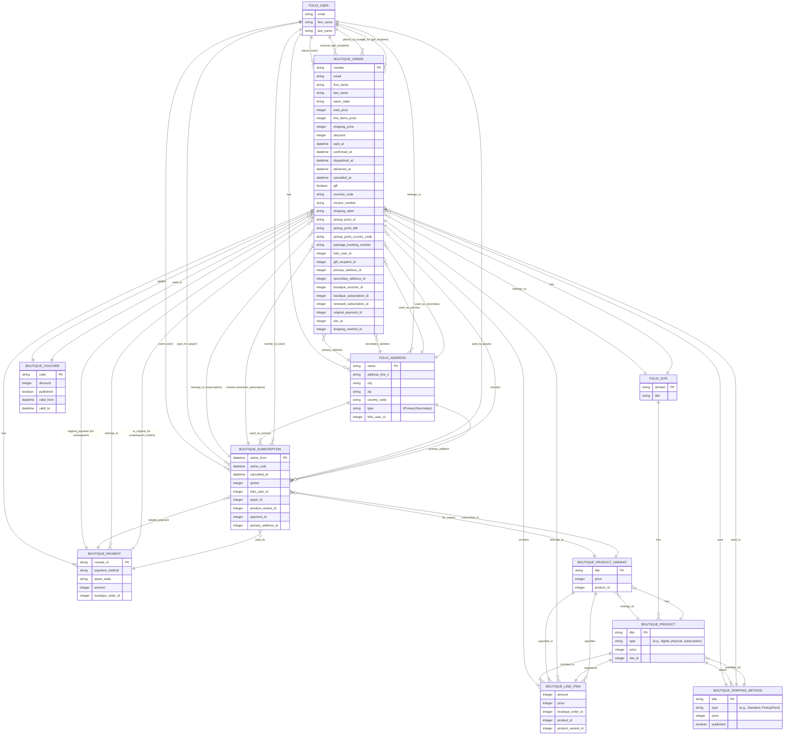
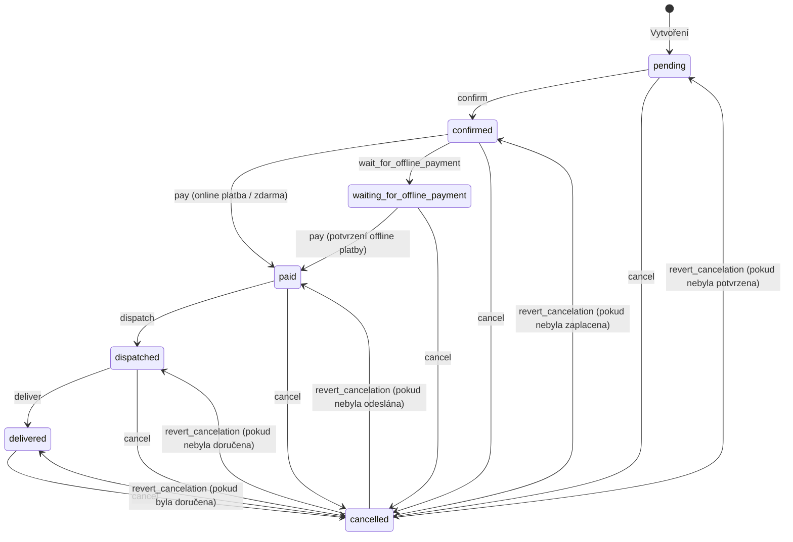
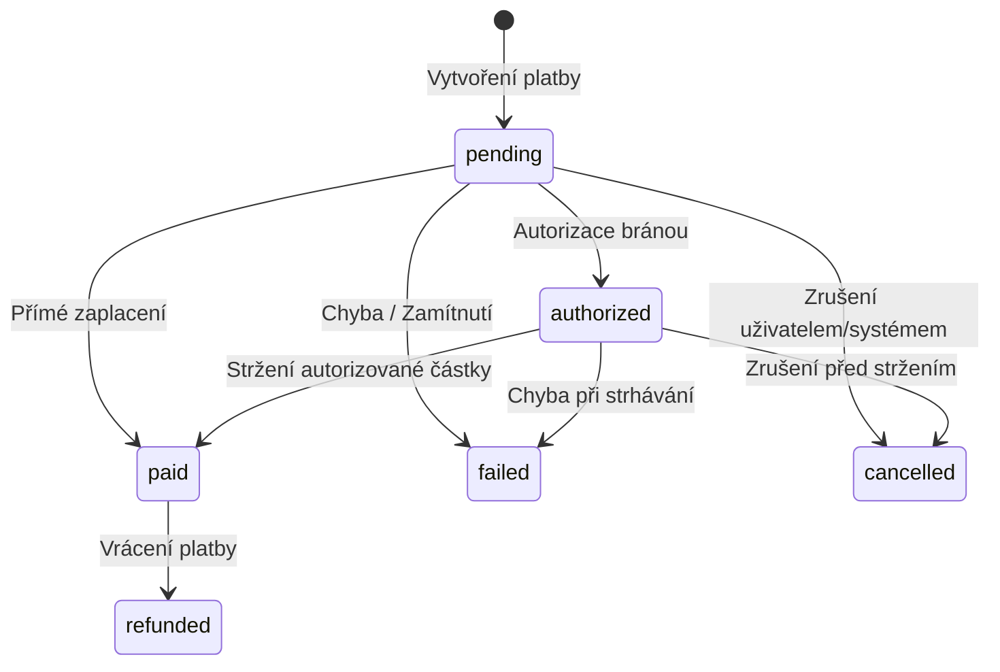

# Boutique - Specifikace Datového Modelu a Konceptů

## 1. Úvod

Tento dokument popisuje datový model a klíčové koncepty e-commerce platformy Boutique. Slouží jako základ pro pochopení entit, jejich vztahů a základní business logiky. Je východiskem pro další revizi a rozvoj.

## 2. Klíčové Koncepty

### 2.1. Jednorázový Nákup vs. Předplatné

Systém Boutique podporuje dva základní modely prodeje: jednorázové nákupy a předplatné. Rozlišení mezi nimi má dopad na více částí systému:

*   **Objednávky (`Boutique::Order`):**
    *   **Jednorázový nákup:** Zákazník vytvoří jednu objednávku, která projde standardním životním cyklem (potvrzení, platba, odeslání, doručení/vyřízení).
    *   **Předplatné:** Vytváří se:
        1.  *Počáteční objednávka:* Zákazník zakoupí produkt typu předplatné. Tato objednávka založí záznam `Boutique::Subscription`.
        2.  *Následné (obnovovací) objednávky:* Systém automaticky generuje nové objednávky v pravidelných intervalech (dle periody předplatného) pro jeho obnovení. Tyto objednávky jsou propojeny s původní platbou (`original_payment_id`) a existujícím předplatným (`boutique_subscription_id`, `renewed_subscription_id`). Jejich úspěšné zaplacení prodlužuje platnost záznamu `Boutique::Subscription`.

*   **Platby (`Boutique::Payment`):**
    *   **Jednorázový nákup:** K objednávce se váže jedna nebo více platebních pokusů, dokud není dosaženo stavu `paid` (nebo `failed`/`cancelled`).
    *   **Předplatné:**
        1.  *Počáteční platba:* Platba za první objednávku často slouží k autorizaci opakovaných plateb (tokenizace karty, souhlas s recurrentní platbou). ID této platby se ukládá do následných objednávek jako `original_payment_id`.
        2.  *Opakované platby:* U automaticky generovaných obnovovacích objednávek se systém pokusí strhnout platbu pomocí uložené platební metody navázané na `original_payment`. Selhání opakované platby může vést k pozastavení nebo zrušení předplatného.

*   **Položky Objednávky (`Boutique::LineItem`):**
    *   **Jednorázový nákup:** Položka reprezentuje konkrétní produkt nebo variantu zakoupenou v daném množství a za cenu platnou v okamžiku objednání.
    *   **Předplatné:** Položka v *počáteční* objednávce reprezentuje zakoupení samotného předplatného (např. "Roční předplatné časopisu X"). Často obsahuje příznaky jako `subscription_recurring` (zda se má automaticky obnovovat) a `subscription_starts_at` (odkdy má běžet). Položky v *obnovovacích* objednávkách pak reprezentují úhradu za další období daného předplatného.

*   **Produktový Design (`Boutique::Product`, `Boutique::ProductVariant`):**
    *   **Jednorázový nákup:** Produkt je obvykle typu `Boutique::Product::Digital` nebo `Boutique::Product::Physical`. Nemá specifické atributy pro předplatné.
    *   **Předplatné:** Produkt musí být typu `Boutique::Product::Subscription`. Musí mít definované atributy jako `subscription_period` (délka periody v měsících) a `subscription_recurring` (zda je ve výchozím stavu opakované). Může mít i `subscription_frequency_in_issues_per_year` (pro výpočet dopravy u fyzických předplatných). Často je konkrétní plán předplatného definován pomocí `Boutique::ProductVariant` (např. Měsíční vs. Roční).

*   **Distribuce / Vyřízení:**
    *   **Jednorázový nákup:** Vyřízení (odeslání fyzického zboží, zpřístupnění digitálního obsahu) probíhá jednou po úspěšném zaplacení objednávky a přechodu do stavu `dispatched` a následně `delivered`.
    *   **Předplatné:** Vyřízení probíhá opakovaně. Po zaplacení *každé* (počáteční i obnovovací) objednávky dochází k akci – typicky prodloužení přístupu ke službě (`active_until` v `Subscription`) nebo zařazení do expedice pro další vydání/zásilku v daném období. Stav `delivered` se v tomto kontextu vztahuje na doručení konkrétní zásilky v rámci předplatného.

### 2.2. Dopravní Metody a Doručení

Systém umožňuje definovat různé způsoby dopravy (`Boutique::ShippingMethod`) a přiřadit je k objednávkám.

*   **Výběr Dopravy:**
    *   Dostupné dopravní metody pro danou objednávku se typicky filtrují na základě produktů v košíku (některé produkty mohou mít omezené možnosti dopravy, viz vztah `Product` -> `ShippingMethod`) a cílové země doručení (z `primary_address`).
    *   Některé metody mohou vyžadovat výběr konkrétního výdejního místa (`requires_pickup_point`). V takovém případě systém interaguje s externí službou pro výběr výdejních míst (např. Zásilkovna Widget) a ukládá ID a název zvoleného místa do objednávky (`pickup_point_id`, `pickup_point_title`, `pickup_point_country_code`).
*   **Cena Dopravy:**
    *   Cena dopravy (`shipping_price` v `Order`) se určuje na základě zvolené `ShippingMethod`.
    *   Cena může být závislá na cílové zemi. Model `ShippingMethod` pravděpodobně obsahuje logiku pro určení ceny pro danou zemi (metoda `price_for(country_code)`).
    *   Systém počítá i DPH z ceny dopravy (`shipping_price_vat`), typicky s použitím standardní sazby DPH dané země nebo fixní sazby definované v konfiguraci (`shipping_vat_rate_value`).
*   **Sledování Zásilek:**
    *   Po odeslání zásilky (`dispatch`) je možné do objednávky uložit sledovací číslo (`package_tracking_number`).
    *   Systém pak může (pomocí metody `tracking_url` v `ShippingMethod`) generovat odkaz pro sledování zásilky u dopravce.
*   **Doručení:**
    *   Po fyzickém doručení zásilky (nebo automaticky po určité době) se stav objednávky mění na `delivered`. Toto může být iniciováno manuálně administrátorem nebo automaticky na základě informací od dopravce (pokud existuje integrace).

### 2.3. Správa DPH (VAT)

Systém musí správně kalkulovat a evidovat Daň z Přidané Hodnoty (DPH).

*   **Sazby DPH:**
    *   Každý produkt (`Product` nebo `ProductVariant`) by měl mít přiřazenou sazbu DPH (např. standardní, snížená, nulová). Tento atribut není explicitně vidět v poskytnutém kódu `Order`, ale je nezbytný pro správný výpočet. Předpokládáme existenci atributu jako `vat_rate` (např. číselník nebo hodnota 21, 15, 0).
    *   Sazba DPH pro dopravu je buď definována globálně (`shipping_vat_rate_value` v `Order`) nebo může být závislá na `ShippingMethod` či produktech v košíku.
*   **Výpočet DPH:**
    *   Pro každou položku objednávky (`LineItem`) se počítá DPH na základě ceny položky a DPH sazby daného produktu/varianty.
    *   Pro dopravu se počítá DPH na základě `shipping_price` a příslušné sazby DPH pro dopravu (`shipping_price_vat`).
    *   Celková DPH za objednávku (`total_price_vat` v `Order`) je součtem DPH jednotlivých položek a DPH za dopravu.
*   **Ceny s/bez DPH:**
    *   Systém by měl být schopen pracovat s cenami zadanými buď s DPH nebo bez DPH a správně zobrazovat obě varianty zákazníkovi i v administraci.
    *   Metody jako `total_price_without_vat` a `shipping_price_without_vat` v `Order` umožňují získat ceny bez daně.
*   **Mezinárodní DPH (EU OSS):**
    *   Pro prodeje v rámci EU koncovým zákazníkům (B2C) může být nutné aplikovat sazbu DPH země doručení (dle pravidel One Stop Shop - OSS). Systém by měl být schopen:
        *   Identifikovat zemi doručení z `primary_address`.
        *   Načíst správnou sazbu DPH pro danou zemi a typ produktu.
        *   Aplikovat tuto sazbu při výpočtu ceny a DPH.
        *   Evidovat tyto transakce pro účely hlášení OSS. (Tato logika není plně viditelná v poskytnutém kódu a může vyžadovat rozšíření).
*   **Fakturace:**
    *   Na faktuře musí být správně rozepsány základy daně a výše DPH pro jednotlivé sazby (za produkty i dopravu). Číslo faktury se ukládá do `invoice_number` v `Order`.

## 3. Datový Model

### 3.1. ER Diagram

Následující diagram znázorňuje hlavní datové modely a jejich propojení (aktualizováno o ShippingMethod a nové atributy Order).


*Poznámka: Modely `Folio::*` jsou pravděpodobně součástí core engine `Folio`. Diagram zobrazuje klíčové atributy a vztahy.*

### 3.2. Popis Klíčových Modelů

Zde je podrobnější vysvětlení účelu, role a atributů jednotlivých klíčových modelů v systému Boutique:

#### 3.2.1. Boutique::Order

**Popis:**
Základní kámen celého nákupního procesu. `Order` představuje kompletní záznam o tom, co si zákazník objednal, za jakou cenu, jakým způsobem a kam to má být doručeno (nebo jak zpřístupněno u digitálních produktů), jaký je stav vyřízení (od vytvoření v košíku až po doručení/zrušení) a jak bylo zaplaceno. Uchovává všechny důležité informace pohromadě – údaje o zákazníkovi, seznam položek (`LineItem`), ceny, slevy (`Voucher`), informace o platbě (`Payment`), doručovací/fakturační adresu (`Address`), zvolený způsob dopravy (`ShippingMethod`) a informace o předplatném (`Subscription`), pokud je součástí.

**Klíčové Atributy:**

- **`number` (Číslo objednávky):** Unikátní identifikátor objednávky viditelný pro zákazníka i administrátora (např. `2300001`).
- **`base_number` (Základní číslo):** Interní sekvenční číslo, ze kterého se odvozuje `number`.
- **`email`, `first_name`, `last_name`:** Základní identifikační údaje zákazníka pro tuto objednávku.
- **`aasm_state` (Stav):** Aktuální stav objednávky v procesu zpracování (viz Kapitola 4.1.).
- **`total_price` (Celková cena):** Finální cena objednávky po započtení ceny položek, ceny dopravy a slevy.
- **`line_items_price` (Cena položek):** Součet cen všech položek v objednávce před slevou a dopravou.
- **`shipping_price` (Cena dopravy):** Cena za zvolený způsob dopravy (`ShippingMethod`), vypočtená na základě cílové země (z adresy nebo výdejního místa).
- **`discount` (Sleva):** Celková výše slevy aplikovaná na objednávku (obvykle z voucheru).
- **`voucher_code` (Kód voucheru):** Kód použitého slevového voucheru.
- **`confirmed_at`, `paid_at`, `dispatched_at`, `delivered_at`, `cancelled_at`:** Časové značky klíčových událostí v životním cyklu objednávky.
- **`gift`, `gift_recipient_*`:** Atributy pro označení a správu objednávky jako dárku.
- **`invoice_number` (Číslo faktury):** Číslo daňového dokladu.
- **`use_secondary_address`:** Příznak pro použití fakturační adresy.
- **`shipping_label`:** Textový popis použité dopravy (např. "Česká pošta - Balík Do ruky").
- **`pickup_point_id`, `pickup_point_title`, `pickup_point_country_code`:** Informace o zvoleném výdejním místě, pokud `ShippingMethod` vyžaduje výdejní místo.
- **`package_tracking_number`:** Sledovací číslo zásilky poskytnuté dopravcem.

**Vztahy (Propojení):**

- **`folio_user_id` -> `Folio::User`:** Zákazník, který objednávku vytvořil.
- **`gift_recipient_id` -> `Folio::User`:** Příjemce dárku.
- **`primary_address_id`, `secondary_address_id` -> `Folio::Address`:** Doručovací a fakturační adresa.
- **`line_items` -> `Boutique::LineItem`:** Položky v objednávce.
- **`payments` -> `Boutique::Payment`:** Platby k objednávce.
- **`paid_payment` -> `Boutique::Payment`:** Úspěšně zaplacená platba.
- **`original_payment_id` -> `Boutique::Payment`:** Odkaz na původní platbu pro opakované strhávání u předplatných.
- **`boutique_voucher_id` -> `Boutique::Voucher`:** Použitý voucher.
- **`boutique_subscription_id`, `renewed_subscription_id` -> `Boutique::Subscription`:** Vazby na předplatné.
- **`site_id` -> `Folio::Site`:** Web, kde byla objednávka vytvořena.
- **`shipping_method_id` -> `Boutique::ShippingMethod`:** Zvolený způsob dopravy.

#### 3.2.2. Folio::User

**Popis:**
Reprezentuje jakoukoliv osobu interagující se systémem, primárně zákazníka, ale může to být i administrátor. `User` uchovává základní přihlašovací a identifikační údaje (email, jméno, heslo - i když to zde není explicitně zobrazeno). Slouží jako centrální bod pro propojení všech aktivit dané osoby – jejích objednávek (`Order`), aktivních předplatných (`Subscription`) a uložených adres (`Address`). Důležité je, že systém rozlišuje mezi uživatelem, který objednávku vytvořil, a uživatelem, který je příjemcem dárku (`gift_recipient` v `Order`), nebo mezi tím, kdo předplatné vlastní, a tím, kdo ho platí (`payer` v `Subscription`).

**Klíčové Atributy:**

- **`email`:** Unikátní emailová adresa uživatele, slouží i jako přihlašovací jméno.
- **`first_name` (Jméno):** Křestní jméno.
- **`last_name` (Příjmení):** Příjmení.
- **`encrypted_password`:** Zahashované heslo uživatele (standardní pro Devise/autentizační systémy).
- **`confirmed_at`:** Datum a čas potvrzení emailové adresy.
- **`invitation_token`, `invitation_created_at`, `invitation_sent_at`, `invitation_accepted_at`:** Atributy související s procesem pozvání uživatele do systému.

**Vztahy (Propojení):**

- **`orders` -> `Boutique::Order`:** Objednávky vytvořené tímto uživatelem.
- **`gift_recipient_orders` -> `Boutique::Order`:** Objednávky, kde je tento uživatel obdarovaným.
- **`subscriptions` -> `Boutique::Subscription`:** Předplatná vlastněná tímto uživatelem.
- **`payer_subscriptions` -> `Boutique::Subscription`:** Předplatná placená tímto uživatelem.
- **`addresses` -> `Folio::Address`:** Adresy patřící tomuto uživateli.

#### 3.2.3. Boutique::LineItem

**Popis:**
Představte si `LineItem` jako řádek na účtence nebo v nákupním košíku. Je to spojovací článek mezi konkrétní objednávkou (`Order`) a konkrétním produktem (`Product` nebo `ProductVariant`), který si zákazník kupuje. Definuje, *kolik kusů* daného produktu (`amount`) bylo objednáno a za jakou *cenu za kus* (`price`) v rámci této konkrétní objednávky. Toto je důležité, protože cena produktu se může časem měnit, ale `LineItem` uchovává cenu platnou v okamžiku objednání.

**Klíčové Atributy:**

- **`amount` (Množství):** Počet kusů daného produktu/varianty v této položce objednávky.
- **`price` (Cena):** Cena za jeden kus produktu/varianty v okamžiku přidání do objednávky (po započtení případné slevy na úrovni produktu/varianty, ale před započtením voucheru na celou objednávku).
- **`subscription_recurring` (Opakované předplatné):** Příznak (ano/ne) relevantní pro položky typu předplatné, indikuje, zda si zákazník přeje automatické obnovování.
- **`subscription_starts_at` (Začátek předplatného):** Datum, odkdy má předplatné začít platit (může se lišit od data objednávky).

**Vztahy (Propojení):**

- **`order_id` -> `Boutique::Order`:** Objednávka, ke které tato položka patří.
- **`product_id` -> `Boutique::Product`:** Produkt, kterého se položka týká.
- **`product_variant_id` -> `Boutique::ProductVariant`:** Konkrétní varianta produktu (pokud byla zvolena).

#### 3.2.4. Boutique::Product

**Popis:**
Reprezentuje cokoliv, co obchod nabízí k prodeji... Produkt může mít definované, které způsoby dopravy (`ShippingMethod`) jsou pro něj povoleny.

**Klíčové Atributy:**

- **`title` (Název):** Název produktu.
- **`type` (Typ):** Typ produktu (např. digital, physical, subscription).
- **`price` (Cena):** Cena produktu.
- **`site_id` (ID webu):** ID webu, ke kterému produkt patří.

**Vztahy (Propojení):**

- **`variants` -> `Boutique::ProductVariant`:** Varianty produktu.
- **`site_id` -> `Folio::Site`:** Web, ke kterému produkt patří.
- **`shipping_methods` -> `Boutique::ShippingMethod`:** Povolené způsoby dopravy pro tento produkt.

#### 3.2.5. Boutique::ProductVariant

**Popis:**
Umožňuje pro jeden `Product` nabízet různé verze, které se liší vlastnostmi jako je velikost, barva, materiál, délka licence nebo typ předplatného. Každá `ProductVariant` může mít vlastní specifický název (např. "Červená, XL") a hlavně může mít vlastní cenu, která má přednost před základní cenou produktu. Zákazník si do košíku vkládá buď samotný `Product` (pokud nemá varianty), nebo konkrétní `ProductVariant`.

**Klíčové Atributy:**

- **`title` (Název varianty):** Specifický název varianty (např. "Červená", "Velikost L", "Roční licence").
- **`price` (Cena varianty):** Cena specifická pro tuto variantu. Pokud je nastavena, přepíše základní cenu produktu.
- **`master` (Hlavní varianta):** Příznak, zda se jedná o výchozí nebo "hlavní" variantu produktu.

**Vztahy (Propojení):**

- **`product_id` -> `Boutique::Product`:** Propojení na hlavní produkt, ke kterému varianta patří.

#### 3.2.6. Boutique::Payment

**Popis:**
Zachycuje informace o finanční transakci spojené s objednávkou. Každý pokus o zaplacení (úspěšný i neúspěšný) může vytvořit záznam `Payment`. Uchovává informace o použité platební metodě (karta, převod), stavu platby (čekající, zaplaceno, selhalo), zaplacené částce a často i unikátní identifikátor platby z platební brány (`remote_id`). U předplatných hraje klíčovou roli `original_payment` v `Order` – to je ta původní platba, která autorizovala budoucí automatické strhávání pro obnovení předplatného.

**Klíčové Atributy:**

- **`remote_id` (ID platby u brány):** Unikátní identifikátor transakce vrácený platební bránou.
- **`payment_method` (Platební metoda):** Identifikátor použité platební metody (např. `CARD`, `BANK_TRANSFER`).
- **`aasm_state` (Stav):** Aktuální stav platby (viz Kapitola 4.2.).
- **`amount` (Částka):** Výše částky této platební transakce.

**Vztahy (Propojení):**

- **`order_id` -> `Boutique::Order`:** Objednávka, ke které se platba vztahuje.
- **`subsequent_orders` -> `Boutique::Order`:** Objednávky (obnovovací pro předplatné), které byly placeny na základě autorizace této (původní) platby.
- **`subscription` -> `Boutique::Subscription`:** Předplatné, které bylo touto platbou zaplaceno/obnoveno.

#### 3.2.7. Boutique::Subscription

**Popis:**
Modeluje vztah se zákazníkem založený na opakovaném plnění – typicky předplatné časopisu, služby nebo pravidelné dodávky zboží. `Subscription` definuje, jaký produkt (`ProductVariant`) si zákazník předplácí, kdo je vlastníkem/uživatelem (`User`) a kdo platícím (`payer`), jaká je perioda (měsíční, roční), a hlavně odkdy dokdy je předplatné aktivní (`active_from`, `active_until`). Systém na základě těchto informací automaticky generuje nové objednávky (`Order`) pro obnovení předplatného a pokouší se strhnout platbu (pokud je předplatné nastaveno jako opakované).

**Klíčové Atributy:**

- **`active_from` (Aktivní od):** Datum a čas, odkdy je předplatné platné.
- **`active_until` (Aktivní do):** Datum a čas, dokdy je předplatné platné. Při automatickém obnovení se tento datum posouvá.
- **`cancelled_at` (Zrušeno dne):** Datum a čas, kdy bylo předplatné zrušeno (buď uživatelem nebo automaticky, pokud není obnoveno).
- **`period` (Perioda):** Délka jedné periody předplatného v měsících (přebírá se z produktu/varianty v době vytvoření).
- **`state` (Stav):** Indikuje, zda je předplatné `active` (aktivní) nebo `inactive` (neaktivní - vypršelo nebo bylo zrušeno).

**Vztahy (Propojení):**

- **`folio_user_id` -> `Folio::User`:** Uživatel, kterému předplatné patří (ten, kdo ho využívá).
- **`payer_id` -> `Folio::User`:** Uživatel, který předplatné platí (může se lišit od `folio_user_id` u dárků).
- **`product_variant_id` -> `Boutique::ProductVariant`:** Varianta produktu, která je předplacena.
- **`payment_id` -> `Boutique::Payment`:** Poslední platba spojená s tímto předplatným (obnovovací platba).
- **`orders` -> `Boutique::Order`:** Seznam objednávek spojených s tímto předplatným (první nákup i obnovení).
- **`primary_address_id` -> `Folio::Address`:** Adresa spojená s předplatným (obvykle doručovací).

#### 3.2.8. Boutique::Voucher

**Popis:**
Slevový kupón nebo dárkový poukaz. `Voucher` má unikátní kód, definovanou hodnotu slevy (buď jako fixní částka nebo procento z ceny) a může mít různá omezení – platnost od/do, maximální počet použití, nebo omezení jen na určité produkty. Zákazník zadá kód voucheru (`voucher_code` v `Order`) a systém ověří jeho platnost a aplikuje slevu (`discount` v `Order`).

**Klíčové Atributy:**

- **`code` (Kód):** Unikátní kód voucheru, který zadává zákazník.
- **`discount` (Sleva):** Hodnota slevy.
- **`discount_in_percentages` (Sleva v procentech):** Příznak, zda je `discount` fixní částka nebo procento.
- **`published` (Publikováno):** Zda je voucher aktivní a použitelný.
- **`valid_from`, `valid_to` (Platnost od/do):** Časové omezení platnosti voucheru.
- **`usage_limit` (Limit použití):** Maximální počet použití voucheru celkem.
- **`used_count` (Počet použití):** Aktuální počet použití.

**Vztahy (Propojení):**

- **`orders` -> `Boutique::Order`:** Objednávky, ve kterých byl tento voucher použit.

#### 3.2.9. Folio::Address

**Popis:**
Slouží k uložení poštovních adres zákazníků. Každý uživatel (`User`) může mít uloženo více adres. V kontextu objednávky (`Order`) a předplatného (`Subscription`) se typicky rozlišuje primární adresa (obvykle doručovací) a sekundární adresa (obvykle fakturační, pokud se liší). Systém pak ví, kam má zboží poslat a jaké údaje uvést na faktuře.

**Klíčové Atributy:**

- **`type`:** Rozlišení typu adresy (např. `Folio::Address::Primary`, `Folio::Address::Secondary`).
- **`name` (Jméno/Název):** Jméno osoby nebo název firmy na adrese.
- **`company_name` (Název firmy):** Samostatné pole pro název firmy.
- **`address_line_1`, `address_line_2` (Řádek adresy 1, 2):** Ulice, číslo popisné/orientační.
- **`city` (Město):** Název města.
- **`zip` (PSČ):** Poštovní směrovací číslo.
- **`country_code` (Kód země):** Dvoupísmenný kód země (např. CZ, SK, GB).
- **`identification_number` (IČO):** Identifikační číslo osoby/firmy.
- **`vat_identification_number` (DIČ):** Daňové identifikační číslo.

**Vztahy (Propojení):**

- **`folio_user_id` -> `Folio::User`:** Uživatel, ke kterému adresa patří.
- Vazby z `Order` a `Subscription` na primární/sekundární adresu.

#### 3.2.10. Folio::Site

**Popis:**
Používá se v případě, že jedna instance aplikace Boutique obsluhuje více různých webových stránek (domén) s potenciálně odlišnou nabídkou produktů nebo cenami. `Site` reprezentuje jednu takovou stránku. Produkty (`Product`) a objednávky (`Order`) mohou být přiřazeny ke konkrétní `Site`, což umožňuje oddělit data a chování pro jednotlivé weby.

**Klíčové Atributy:**

- **`title` (Název):** Název stránky.
- **`domain` (Doména):** Hlavní doména stránky.
- **`locale` (Jazyk):** Výchozí jazyk pro stránku.

**Vztahy (Propojení):**

- **`products` -> `Boutique::Product`:** Produkty patřící k této stránce.
- **`orders` -> `Boutique::Order`:** Objednávky vytvořené na této stránce.

#### 3.2.11. Boutique::ShippingMethod

**Popis:**
Definuje způsob dopravy, který si zákazník může zvolit pro doručení své objednávky. Obsahuje název (např. "Česká pošta - Balík Do ruky", "Zásilkovna - Výdejní místo"), cenu a pravidla chování. Umožňuje rozlišovat mezi standardním doručením na adresu a vyzvednutím na výdejním místě. Cena může být konfigurována různě pro různé země doručení. Metoda musí být publikovaná (`published`), aby byla nabízena zákazníkům, a může být omezena jen na určité produkty.

**Klíčové Atributy:**

- **`title` (Název):** Název způsobu dopravy zobrazený zákazníkovi.
- **`type` (Typ):** Interní identifikátor typu pro specifickou logiku (např. `Boutique::ShippingMethod::Standard`, `Boutique::ShippingMethod::PickupPoint`).
- **`price` (Cena):** Výchozí cena dopravy (např. pro domácí zemi). Může být přepsána cenou specifickou pro zemi doručení (pravděpodobně uložena v asociovaném modelu nebo Hstore/JSONB poli, které zde není vidět).
- **`published` (Publikováno):** Zda je tento způsob dopravy aktivní a nabízený zákazníkům.
- **`requires_pickup_point` (Vyžaduje výdejní místo):** Příznak (ano/ne), zda musí zákazník v rámci této metody zvolit konkrétní výdejní místo.

**Vztahy (Propojení):**

- **`orders` -> `Boutique::Order`:** Objednávky používající tento způsob dopravy.
- Vazba z `Product` (`product.shipping_methods`) určující, pro které produkty je tato metoda dostupná.
- (Potenciálně) Vazba na model/konfiguraci cen pro různé země.

## 4. Životní Cykly (Stavové Přechody - AASM)

Tato sekce popisuje životní cyklus klíčových modelů pomocí stavových diagramů.

### 4.1. Objednávka (Boutique::Order)

Objednávka prochází několika stavy od svého vytvoření až po finální vyřízení nebo zrušení (aktualizováno o stav `delivered`).

**Stavy:**

- `pending` (Čekající): Výchozí stav.
- `confirmed` (Potvrzená): Zákazník dokončil objednávkový proces.
- `waiting_for_offline_payment` (Čeká na offline platbu): Pro neokamžité platby.
- `paid` (Zaplacená): Platba přijata.
- `dispatched` (Odeslaná): Zboží bylo fyzicky odesláno / digitální produkt zpřístupněn.
- `delivered` (Doručená): Zásilka byla doručena (potvrzeno dopravcem nebo systémem).
- `cancelled` (Zrušená): Objednávka zrušena.

**Události a Přechody:**

- `confirm`: `pending` -> `confirmed`.
- `wait_for_offline_payment`: `confirmed` -> `waiting_for_offline_payment`.
- `pay`: `confirmed` / `waiting_for_offline_payment` -> `paid`. U digitálních produktů může rovnou přejít do `delivered` (přes `dispatch` a `deliver`).
- `dispatch`: `paid` -> `dispatched`.
- `deliver`: `dispatched` -> `delivered`.
- `cancel`: (libovolný stav kromě `cancelled`) -> `cancelled`.
- `revert_cancelation`: `cancelled` -> (předchozí stav - `delivered`, `dispatched`, `paid`, `confirmed`, `pending`).

**Diagram:**



### 4.2. Platba (Boutique::Payment)

Stavy platby závisí na konkrétní implementaci platební brány, ale typický životní cyklus může vypadat následovně:

**Možné Stavy:**

- `pending` (Čekající): Platba byla inicializována, čeká se na akci uživatele nebo potvrzení brány.
- `authorized` (Autorizovaná): Platba byla bránou schválena, ale prostředky ještě nebyly strženy (relevantní u některých karetních transakcí).
- `paid` (Zaplacená): Prostředky byly úspěšně strženy a připsány.
- `failed` (Selhala): Platba z nějakého důvodu selhala (nedostatek prostředků, chyba karty, zamítnutí uživatelem).
- `cancelled` (Zrušená): Platba byla aktivně zrušena uživatelem nebo systémem před dokončením.
- `refunded` (Vrácená): Částka byla vrácena zákazníkovi.

**Diagram (Příklad):**


*Poznámka: Skutečné stavy a přechody pro `Boutique::Payment` mohou být odlišné v závislosti na použité platební bráně a konfiguraci.*

## 5. Specifická Business Logika

Tato kapitola popisuje klíčové procesy a výpočty v rámci systému.

### 5.1. Výpočet Cen a DPH

Výpočet finální ceny objednávky (`total_price`) a související DPH je vícekrokový proces. Klíčové vypočtené hodnoty (`line_items_price`, `discount`, `shipping_price`, `total_price`) jsou často "otištěny" (uloženy napevno) do objednávky v okamžiku jejího potvrzení pomocí metody `imprint`, aby se zabránilo jejich pozdější změně vlivem úprav cen produktů nebo podmínek voucherů.

1.  **Cena položek (`line_items_price`):** Je to prostý součet cen (`price`) všech položek (`LineItem`) v objednávce. Cena každé položky je zafixována v okamžiku jejího přidání do objednávky a již zahrnuje případné slevy na úrovni produktu nebo varianty.
2.  **Cena dopravy (`shipping_price`):** Určuje se na základě zvoleného způsobu dopravy (`ShippingMethod`) a cílové země (z `primary_address` nebo `pickup_point_country_code`). Metoda `shipping_method.price_for(country_code)` vrací příslušnou cenu. Pokud je objednávka čistě digitální (`digital_only?`) nebo není zvolena doprava, cena je 0.
3.  **Sleva (`discount`):** Pokud je k objednávce přiřazen platný voucher (`Voucher`), vypočítá se sleva. Výpočet zohledňuje, zda je sleva procentuální nebo fixní. U procentuální slevy se základem pro výpočet stává `line_items_price_without_discount` (cena položek před započtením slev na úrovni produktu) a případně `shipping_price` (pokud voucher pokrývá i dopravu). Od vypočtené slevy z voucheru se odečítají již započtené slevy na úrovni produktů, aby nedošlo k dvojitému započtení. Výsledná sleva nemůže být záporná.
4.  **Celková cena (`total_price`):** Vypočítá se jako `line_items_price + shipping_price - discount`. Výsledná cena nemůže být záporná (minimum je 0).
5.  **Výpočet DPH:**
    *   **DPH položek:** Pro každou `LineItem` se vypočítá DPH na základě její ceny (`price`) a sazby DPH přiřazené k danému produktu/variantě (tato sazba musí být někde uložena, např. v `Product`/`ProductVariant`).
    *   **DPH dopravy (`shipping_price_vat`):** Vypočítá se z `shipping_price` pomocí sazby DPH pro dopravu (konfigurovatelná hodnota `shipping_vat_rate_value`).
    *   **Celková DPH (`total_price_vat`):** Je součtem DPH všech položek a DPH za dopravu.
    *   **Ceny bez DPH:** Metody jako `total_price_without_vat` a `shipping_price_without_vat` umožňují od celkové ceny odečíst vypočtenou DPH.
6.  **OSS Logika:** V případě prodeje B2C do jiné země EU by se při výpočtu DPH položek měla uplatnit sazba DPH cílové země. To vyžaduje:
    *   Databázi/konfiguraci sazeb DPH pro jednotlivé země EU a typy produktů.
    *   Identifikaci cílové země z `primary_address`.
    *   Aplikaci správné sazby při výpočtu DPH pro `LineItem` a potenciálně i pro `shipping_price_vat`.

### 5.2. Aplikace Slev (Vouchery)

Proces použití slevového voucheru:

1.  **Zadání kódu:** Zákazník zadá kód voucheru (`voucher_code`) v košíku nebo pokladně.
2.  **Validace (`validate_voucher_code`):** Systém ověří platnost kódu:
    *   Zda voucher s daným kódem existuje (`Boutique::Voucher.find_by_token_case_insensitive`).
    *   Zda není vyčerpán limit použití (`used_up?`).
    *   Zda je publikovaný (`published?`).
    *   Zda je platný v aktuálním čase (pokud má `valid_from`/`valid_to`).
    *   Zda je relevantní pro produkty v košíku (`relevant_for?`). (Aktuálně zjednodušeno na první produkt).
3.  **Přiřazení:** Pokud je voucher platný, přiřadí se k objednávce (nastaví se asociace `voucher`).
4.  **Výpočet slevy:** Při ukládání/přepočtu objednávky (`imprint`) se vypočítá hodnota `discount` dle logiky popsané v sekci 5.1.
5.  **Označení použití (`use_voucher!`):** Po úspěšném potvrzení objednávky (`confirm`) se na voucheru zavolá metoda `use!`, která typicky inkrementuje čítač `used_count`.

### 5.3. Logika Dárků

Objednávku lze označit jako dárek, což spouští specifickou logiku:

1.  **Označení:** Zákazník označí objednávku jako dárek (nastaví se `gift: true`).
2.  **Zadání údajů:** Zákazník vyplní údaje o obdarovaném (`gift_recipient_email`, `gift_recipient_first_name`, `gift_recipient_last_name`) a případně datum a čas odeslání notifikace (`gift_recipient_notification_scheduled_for`).
3.  **Validace:** Systém ověří, že jsou vyplněny povinné údaje pro dárek a že `gift_recipient_notification_scheduled_for` není v minulosti (pokud je zadáno).
4.  **Notifikace (`deliver_gift!`):** Tato metoda (pravděpodobně volaná manuálně nebo plánovačem na základě `gift_recipient_notification_scheduled_for`) zajišťuje:
    *   Vyhledání uživatele (`Folio::User`) podle `gift_recipient_email`. Pokud neexistuje, je pozván do systému (ale pozvánka se neposílá hned).
    *   Odeslání emailové notifikace obdarovanému. Pokud uživatel neexistoval, email obsahuje i odkaz pro dokončení registrace/převzetí dárku.
    *   Přiřazení `gift_recipient_id` k objednávce.
    *   Pokud je součástí objednávky předplatné (`Subscription`), vlastnictví předplatného (`folio_user_id` v `Subscription`) se přepíše na obdarovaného (`gift_recipient_id`).
    *   Zaznamená se čas odeslání notifikace (`gift_recipient_notification_sent_at`).
5.  **Adresy:** Při zakládání uživatele obdarovaného se mu může automaticky zkopírovat primární adresa z objednávky. Při vytváření předplatného se jako adresa předplatného použije adresa z objednávky, ale jméno na adrese se přepíše jménem obdarovaného.

### 5.4. Generování Faktur

Proces související s generováním faktur:

1.  **Přiřazení čísla (`set_invoice_number`):** Po úspěšné platbě objednávky (`pay`) se vygeneruje a přiřadí unikátní číslo faktury (`invoice_number`). Generování využívá databázovou sekvenci (`boutique_orders_invoice_base_number_seq`), která se může resetovat každý rok (dle konfigurace `Boutique.config.invoice_number_resets_each_year`). Číslo může obsahovat prefix roku (dle `Boutique.config.invoice_number_with_year_prefix`), vlastní definovaný prefix (`invoice_number_prefix`) a má definovanou délku číselné části (dle `Boutique.config.invoice_number_base_length`).
2.  **Generování dokumentu:** Samotné vygenerování PDF (nebo jiného formátu) faktury není přímo součástí modelu `Order`. Systém využívá data z objednávky a souvisejících modelů (zákazník, adresy, položky, ceny, DPH rozpis) a předává je externí knihovně nebo službě pro generování faktur (např. Prawn, WickedPDF, nebo externí fakturační API).
3.  **Obsah faktury:** Faktura musí obsahovat všechny zákonné náležitosti, včetně:
    *   Identifikace dodavatele a odběratele (z `Order`, `Folio::User`, `Folio::Address`).
    *   Číslo faktury (`invoice_number`), datum vystavení (typicky `paid_at`), datum zdanitelného plnění.
    *   Seznam položek (`LineItem`) s názvy, množstvím, cenou za jednotku, sazbou DPH a celkovou cenou.
    *   Cenu dopravy (`shipping_price`) a její DPH.
    *   Rozpis DPH dle jednotlivých sazeb (základ daně, výše daně).
    *   Celkovou částku k úhradě (`total_price`).
    *   Případnou poznámku (`invoice_note`).

### 5.5. Podklady pro OSS Hlášení

Pro splnění povinností v rámci režimu One Stop Shop (OSS) pro prodej B2C zboží a služeb do jiných zemí EU systém musí umožnit export dat potřebných pro hlášení.

1.  **Potřebná data:** Pro každou relevantní transakci (objednávku) je nutné evidovat:
    *   Zemi určení (doručení) zboží/služby (typicky `primary_address.country_code`).
    *   Typ transakce (prodej zboží, poskytnutí služby).
    *   Základ daně (cena bez DPH).
    *   Aplikovanou sazbu DPH cílové země.
    *   Vypočtenou výši DPH.
2.  **Zdroj dat:**
    *   Objednávka (`Order`): Poskytuje `total_price`, `paid_at`, odkazy na adresu a položky.
    *   Adresa (`Folio::Address`): Poskytuje zemi doručení (`country_code`).
    *   Položky (`LineItem`): Poskytují cenu položky.
    *   Produkt/Varianta (`Product`/`ProductVariant`): Musí poskytovat typ produktu a sazbu DPH (včetně specifik pro různé země).
    *   Konfigurace/Model Sazeb DPH: Musí existovat mechanismus pro správu a načítání správných sazeb DPH pro různé země a typy produktů.
3.  **Export/Report:** Systém by měl nabízet funkci pro export těchto agregovaných dat za dané období (např. čtvrtletí) ve formátu vhodném pro vyplnění OSS hlášení (např. CSV soubor). Export by měl seskupovat transakce podle země určení a sazby DPH.

## 6. Interakce s Externími Systémy

Boutique platforma typicky potřebuje komunikovat s řadou externích systémů pro zajištění plné funkcionality. Tato kapitola popisuje hlavní body integrace.

### 6.1. Platební Brány

Integrace s platebními bránami (např. GoPay, Stripe, PayPal) je klíčová pro přijímání online plateb.

*   **Inicializace platby:**
    *   Po potvrzení objednávky (`confirm`) a pokud není objednávka zdarma, systém předá platební bráně potřebné údaje (částka, měna, ID objednávky, návratové URL).
    *   Brána vrátí URL pro přesměrování zákazníka nebo data pro zobrazení platebního formuláře/widgetu.
    *   Systém vytvoří záznam `Boutique::Payment` ve stavu `pending` a uloží ID transakce z brány (`remote_id`).
*   **Zpracování výsledku platby:**
    *   Po dokončení platby (úspěšném či neúspěšném) brána přesměruje zákazníka zpět na definovanou URL adresu nebo zavolá webhook (notifikační endpoint) na straně Boutique.
    *   Boutique přijme informaci o výsledku platby (stav, ID transakce).
    *   Na základě výsledku aktualizuje stav příslušného záznamu `Boutique::Payment` (na `paid`, `failed`, `cancelled`).
    *   Pokud byla platba úspěšná (`paid`), spustí se událost `pay` na související objednávce (`Order`).
*   **Opakované platby (Recurrence/Subscriptions):**
    *   Při první platbě předplatného musí systém od brány získat a bezpečně uložit token nebo referenci na platební metodu zákazníka pro budoucí strhávání.
    *   Pro automatické obnovovací objednávky systém iniciuje stržení platby u brány pomocí uloženého tokenu/reference, aniž by vyžadoval interakci zákazníka.
    *   Systém musí reagovat na případné chyby při opakovaném strhávání (např. expirace karty, nedostatek prostředků) a případně zrušit související předplatné (`Subscription`).
*   **Refundace:**
    *   Administrátor může iniciovat vrácení platby (refundaci) přes administraci Boutique.
    *   Systém zavolá API platební brány pro provedení refundace.
    *   Po potvrzení refundace od brány aktualizuje stav `Boutique::Payment` na `refunded`.

### 6.2. Dopravci

Integrace s dopravci (např. Zásilkovna, Česká pošta, PPL, DPD) zahrnuje několik oblastí:

*   **Výběr výdejních míst:**
    *   Pokud zvolená `ShippingMethod` vyžaduje výdejní místo (`requires_pickup_point`), Boutique musí integrovat frontendový widget poskytovaný dopravcem (např. Zásilkovna Packetery Widget).
    *   Tento widget umožní zákazníkovi vybrat konkrétní pobočku.
    *   Po výběru widget vrátí ID a další údaje o pobočce, které Boutique uloží do objednávky (`pickup_point_id`, `pickup_point_title`, `pickup_point_country_code`).
*   **Podání zásilek (Expediční API):**
    *   Pro automatizaci expedice může Boutique odesílat data o připravených zásilkách do systému dopravce přes jeho API.
    *   Typicky se posílají údaje o odesílateli, příjemci (z `Order` a `Folio::Address`), rozměrech a váze zásilky, zvolené službě a případně ID výdejního místa.
    *   API dopravce vrátí štítek pro tisk a sledovací číslo zásilky (`package_tracking_number`), které se uloží k objednávce.
*   **Sledování zásilek (Tracking API):**
    *   Boutique může periodicky nebo na vyžádání dotazovat API dopravce na aktuální stav zásilky pomocí sledovacího čísla.
    *   Na základě stavu vráceného API (např. "Doručeno") může Boutique automaticky aktualizovat stav objednávky (`aasm_state` na `delivered`).

### 6.3. Účetní Systémy

Pro usnadnění účetnictví je často žádoucí exportovat data z Boutique do účetního softwaru (např. Pohoda, Money S3, Abra). Viz také kapitola 9 "Exporty Dat".

*   **Export faktur/objednávek:**
    *   Systém by měl umožnit exportovat uhrazené objednávky (`Order` ve stavu `paid` nebo vyšším) za zvolené období.
    *   Export by měl obsahovat všechny relevantní údaje pro zaúčtování: číslo faktury, datum vystavení/platby, údaje o odběrateli, rozpis položek a dopravy s cenami bez DPH, sazbami DPH a výší DPH.
    *   Formát exportu by měl být kompatibilní s importním formátem cílového účetního systému (např. XML, ISDOC, CSV).
*   **Export plateb:**
    *   Může být užitečné exportovat i přehled přijatých plateb (`Payment`) pro párování s bankovními výpisy.
*   **Synchronizace kontaktů:**
    *   Případně může existovat synchronizace zákazníků (`Folio::User`) a jejich adres (`Folio::Address`) s adresářem v účetním systému.

### 6.4. Systémy pro Generování Faktur

Pokud Boutique sám negeneruje PDF faktury, může využívat externí službu nebo systém specializovaný na generování faktur (např. Fakturoid, iDoklad, nebo vlastní microservice). Je také možné, že faktura obsahuje zabezpečený odkaz pro přístup bez přihlášení pomocí `Folio::HasSecretHash` (viz kapitola 11).

*   **Předání dat:**
    *   Po úspěšné platbě objednávky (`pay`) a přidělení čísla faktury (`invoice_number`) systém zavolá API fakturačního systému.
    *   Předají se veškeré potřebné údaje pro vytvoření faktury (viz sekce 5.4).
*   **Získání faktury:**
    *   API fakturačního systému vrátí vygenerovanou fakturu (typicky jako PDF soubor nebo odkaz ke stažení).
*   **Uložení/Odeslání:**
    *   Boutique může uložit odkaz na fakturu nebo samotný PDF soubor (např. pomocí Active Storage) k objednávce.
    *   Faktura může být automaticky přiložena k emailu o potvrzení platby odesílanému zákazníkovi.

## 7. Doplňující Modely a Konfigurace

Tato kapitola nastiňuje modely a konfigurační přístupy pro oblasti, které jsou často součástí e-commerce platforem, ale nebyly detailně popsány v předchozích kapitolách nebo nejsou plně implementovány v analyzovaném kódu.

### 7.1. Kategorie Produktů

Pro lepší organizaci nabídky a navigaci zákazníků je nezbytné produkty kategorizovat.

*   **Potřeba:** Umožnit zařazení produktů (`Product`) do jedné nebo více kategorií, vytvořit hierarchickou strukturu kategorií (strom) a umožnit filtrování produktů podle kategorií na webu.
*   **Možná implementace:**
    *   **Model `Category`:** Samostatný model reprezentující kategorii. Může obsahovat atributy jako `name`, `slug`, `parent_id` (pro stromovou strukturu), `description`.
    *   **Propojení:** Vazba Many-to-Many mezi `Product` a `Category` (např. přes spojovací tabulku `boutique_products_categories`).
    *   **Alternativa (Tagy):** Jednodušší systém může využívat tagování produktů bez striktní hierarchie.

### 7.2. Skladové Hospodářství (Inventář)

Pro fyzické produkty je klíčové sledování skladových zásob, aby se zabránilo prodeji zboží, které není skladem.

*   **Potřeba:** Evidovat počet kusů skladem pro každý prodejný fyzický produkt nebo jeho variantu. Snižovat stav skladu při prodeji a případně ho navyšovat při naskladnění nebo stornu objednávky. Zobrazovat dostupnost zákazníkům a zabránit přidání nedostupného zboží do košíku.
*   **Možná implementace:**
    *   **Atribut `stock_level`:** Přímo na modelu `Product` nebo `ProductVariant`. Vyžaduje pečlivou správu při každé změně stavu objednávky.
    *   **Model `InventoryItem`:** Samostatný model vázaný na `Product`/`ProductVariant`, který uchovává `quantity` a případně další informace (lokace ve skladu atd.).
    *   **Rezervace:** Při přidání do košíku nebo potvrzení objednávky může systém dočasně rezervovat kusy ze skladu.
    *   **Integrace s WMS:** U větších systémů může být správa skladu řešena externím Warehouse Management System, se kterým Boutique komunikuje přes API.

### 7.3. Konfigurace Cen Dopravy

Cena dopravy často závisí na více faktorech než jen na zvolené metodě.

*   **Potřeba:** Umožnit definovat ceny dopravy (`ShippingMethod`) nejen jako fixní částku, ale i v závislosti na cílové zemi, váze zásilky, celkové hodnotě objednávky nebo kombinaci těchto faktorů.
*   **Možná implementace:**
    *   **Rozšíření `ShippingMethod`:** Model `ShippingMethod` může obsahovat komplexnější strukturu pro ceny (např. pole JSONB nebo Hstore `price_matrix`), kde klíče reprezentují kódy zemí a hodnoty jsou ceny nebo odkazy na váhové/cenové tabulky.
    *   **Asociovaný model `ShippingPrice`:** Samostatný model vázaný na `ShippingMethod`, který definuje cenu pro specifickou kombinaci země, váhového/cenového rozmezí.
    *   **Logika `price_for`:** Metoda `price_for` v `ShippingMethod` by implementovala logiku pro vyhledání správné ceny na základě dat objednávky (cílová země, váha položek, celková cena).

### 7.4. Správa Sazeb DPH

Pro správný výpočet DPH, zejména v kontextu mezinárodního prodeje (OSS), je nutná robustní správa sazeb.

*   **Potřeba:** Udržovat aktuální sazby DPH pro různé země (minimálně EU) a potenciálně různé typy produktů (standardní, snížená, nulová sazba). Aplikovat správnou sazbu při výpočtu ceny a DPH v objednávce.
*   **Možná implementace:**
    *   **Model `VatRate`:** Samostatný model uchovávající sazbu (`value`), kód země (`country_code`), typ sazby (např. `standard`, `reduced`) a případně časovou platnost.
    *   **Přiřazení k Produktu:** Model `Product`/`ProductVariant` by měl odkazovat na typ sazby DPH, která se na něj vztahuje (např. atribut `vat_rate_type` s hodnotami `standard`, `reduced`, `zero`).
    *   **Konfigurace:** Alternativně mohou být sazby uloženy v konfiguračním souboru nebo databázové konfigurační tabulce.
    *   **Logika výpočtu:** Při výpočtu DPH (viz 5.1) systém identifikuje zemi doručení, typ produktu, a na základě toho vyhledá a aplikuje správnou sazbu DPH z modelu `VatRate` nebo konfigurace.

## 8. Emailové Notifikace (Mailing)

Systém odesílá zákazníkům a administrátorům emailové notifikace v různých fázích procesu objednávky a správy účtu.

### 8.1. Mechanismus Rozšiřitelnosti (`MAILER_ACTIONS`)

Model `Order` definuje konstantu `MAILER_ACTIONS` (např. `[:paid, :paid_subsequent]`) a pro každou akci metodu `mailer_<akce>` (např. `mailer_paid`). Tyto metody ve výchozím stavu volají standardní mailer (`Boutique::OrderMailer`), ale mohou být přepsány v hlavní aplikaci pro odeslání vlastních emailů nebo provedení jiných akcí spojených s danou událostí.

### 8.2. Spouštění Mailerů a Obsah

Jednotlivé mailery jsou typicky spouštěny jako `after_commit` callbacky po úspěšném přechodu do určitého stavu AASM nebo po provedení specifické akce:

*   **`mailer_paid`:**
    *   **Spouštěč:** Po úspěšném přechodu objednávky do stavu `paid` (v `after_commit` bloku události `pay`), pokud se nejedná o následnou platbu předplatného.
    *   **Účel/Obsah:** Potvrzení o úspěšném zaplacení objednávky zákazníkovi. Obsahuje shrnutí objednávky, informace o platbě, případně odkaz na stažení faktury nebo informace o dalším postupu (odeslání, přístup k digitálnímu obsahu).
*   **`mailer_paid_subsequent`:**
    *   **Spouštěč:** Po úspěšném přechodu objednávky do stavu `paid` (v `after_commit` bloku události `pay`), pokud se jedná o následnou (obnovovací) platbu předplatného (a předplatné má periodu 12 měsíců - *tato podmínka může být specifická*).
    *   **Účel/Obsah:** Potvrzení o úspěšném zaplacení dalšího období předplatného. Informuje o prodloužení platnosti předplatného.
*   **`gift_notification` / `gift_notification_with_invitation`:**
    *   **Spouštěč:** Manuálně nebo plánovačem přes metodu `deliver_gift!`.
    *   **Účel/Obsah:** Informování příjemce dárku o tom, že pro něj byla zakoupena objednávka/předplatné. Varianta `_with_invitation` se použije, pokud příjemce ještě nemá účet, a obsahuje odkaz pro jeho aktivaci.
*   **Pozvánky (`Folio::User.invite!`):**
    *   **Spouštěč:** Při událostech `pay` nebo `wait_for_offline_payment`, pokud zákazník ještě nemá potvrzený účet (metoda `invite_user!`).
    *   **Účel/Obsah:** Standardní Devise Invitable email s výzvou k nastavení hesla a aktivaci účtu.

### 8.3. Diagram Spouštění (Příklad)

```mermaid
stateDiagram-v2
    state "Objednávka" as Order {
        [*] --> pending
        pending --> confirmed : confirm
        confirmed --> paid : pay
        paid --> dispatched : dispatch
        dispatched --> delivered : deliver

        state "paid" as paid_state {
            state "after_commit" as paid_ac
        }
        paid_state: Trigger Mailers
    }
    state "Akce" as Action {
         deliver_gift!
    }
    state "Mailer" as Mailer {
        paid
        paid_subsequent
        gift
    }

    paid_ac --> paid : if not subsequent
    paid_ac --> paid_subsequent : if subsequent & period=12
    Action -- deliver_gift! --> gift

```
*Poznámka: Diagram zjednodušeně ukazuje hlavní body spouštění.*

## 9. Exporty Dat

Systém umožňuje exportovat data pro různé účely:

*   **CSV Export Objednávek:**
    *   **Účel:** Poskytnutí přehledu objednávek pro administrátory nebo pro základní offline zpracování.
    *   **Implementace:** Definován v `Boutique::Order` metodami `csv_attribute_names` (určuje sloupce) a `csv_attributes` (definuje, jak získat hodnoty pro jednotlivé sloupce, např. formátování datumu, spojení jména, výpis položek).
    *   **Spouštění:** Typicky dostupné jako akce v administraci nad seznamem objednávek.
*   **Export pro Účetní Systémy:**
    *   **Účel:** Přenos dat o uhrazených objednávkách/fakturách do externího účetního softwaru.
    *   **Implementace:** Vyžaduje specifický formát (XML, ISDOC, CSV) dle cílového systému. Data zahrnují detaily o zákazníkovi, faktuře, položkách a rozpisu DPH (viz sekce 7.3).
    *   **Spouštění:** Manuální nebo automatizovaný export z administrace.
*   **Export pro OSS Hlášení:**
    *   **Účel:** Získání podkladů pro hlášení DPH v režimu One Stop Shop pro B2C prodeje do EU.
    *   **Implementace:** Agregace dat o prodejích podle země určení a sazby DPH (viz sekce 5.5). Výstupem je typicky CSV nebo jiný strukturovaný formát.
    *   **Spouštění:** Manuální export z administrace za dané období (čtvrtletí).

## 10. Konfigurace Systému (`Boutique.config`)

Chování některých částí systému lze ovlivnit pomocí globální konfigurace, typicky přístupné přes `Boutique.config`. Z analyzovaného kódu vyplývají následující konfigurační volby:

*   **`products_belong_to_site` (boolean):** Pokud je `true`, validace vyžaduje, aby objednávka (`Order`) měla přiřazen `site_id` (relevantní pro multi-site instalace).
*   **`invoice_number_resets_each_year` (boolean):** Pokud je `true`, sekvence pro generování čísel faktur (`boutique_orders_invoice_base_number_seq`) se automaticky resetuje na začátku každého kalendářního roku.
*   **`invoice_number_with_year_prefix` (boolean):** Pokud je `true`, do generovaného čísla faktury (`invoice_number`) se přidává prefix aktuálního roku (poslední dvě číslice).
*   **`invoice_number_base_length` (integer):** Definuje minimální počet číslic pro základní část čísla faktury (bez prefixů). Číslo se zleva doplní nulami, pokud je kratší.
*   **`use_cart_in_orders` (boolean):** Ovlivňuje logiku přidávání položek do objednávky metodou `add_line_item!`. Pokud `true`, přidání stejného produktu navyšuje množství existující položky. Pokud `false` (výchozí chování dle kódu), přidání produktu nahradí stávající položku (vhodné pro scénář, kdy objednávka reprezentuje spíše jednopoložkový nákup nebo košík).

*Poznámka: Mohou existovat další konfigurační volby definované v jiných částech aplikace nebo v inicializátorech.*

## 11. Zabezpečený Přístup (`Folio::HasSecretHash`)

Některé modely, zejména `Boutique::Order`, využívají mixin `Folio::HasSecretHash`.

*   **Účel:** Generování unikátního, těžko uhodnutelného řetězce (hashe) pro každý záznam (např. objednávku). Tento hash (`secret_hash`) se pak používá v URL adresách pro přístup k detailu záznamu bez nutnosti přihlášení zákazníka. Například odkaz v emailu může vést na `/objednavka/abc123xyz`, kde `abc123xyz` je `secret_hash`.
*   **Bezpečnost:** Hash slouží jako forma "hesla" pro přístup ke konkrétnímu záznamu. Délka hashe (`secret_hash_length`) je konfigurovatelná pro zajištění dostatečné odolnosti proti hádání.
*   **Použití:** Primárně pro objednávky, umožňuje zákazníkům zobrazit stav své objednávky z emailu. Potenciálně lze využít i pro jiné entity, např. pro zabezpečený přístup k online verzi faktury.
*   **Generování:** Hash se typicky generuje automaticky při vytvoření záznamu.

## 12. Další Kroky a Otevřené Otázky

*(Popis upraven)*
Tato specifikace pokrývá základní datový model, koncepty, business logiku, interakce s externími systémy, mailing, exporty, konfiguraci, zabezpečený přístup a návrh doplňujících modelů/konfigurací. Dalšími kroky pro zpřesnění a dokončení specifikace mohou být:

-   **Detailní specifikace validačních pravidel:** Popsat všechny validace definované v modelech (`validates`, `validate`), včetně podmínek (`if`, `unless`) a chybových hlášek.
-   **Detailní popis implementace business logiky:**
    *   Rozepsat logiku helper metod (např. `full_name`, `packages_count`, `total_price_vat`, `package_tracking_url`, `requires_address?`).
    *   Rozepsat logiku privátních metod obsahujících klíčové procesy (např. `set_numbers`, `set_invoice_number`, `invite_user!`, `set_up_subscription!`, `imprint`).
-   **Specifikace scopes:** Popsat účel a použití jednotlivých definovaných `scope` v modelu `Order` pro filtrování, řazení a vyhledávání dat.
-   **Full-textové vyhledávání:** Detailně popsat konfiguraci a použití `pg_search_scope :by_query`.
-   **Zpracování chyb:** Detailněji dokumentovat specifické zpracování chyb (např. `GoPay::Error`).
-   **Návrh API rozhraní:** Pokud bude systém poskytovat API, navrhnout jeho endpointy, datové struktury a autentizaci.
-   **Detailní návrh uživatelského rozhraní:** Vytvořit wireframy nebo mockupy pro klíčové obrazovky administrace a zákaznické části.
-   **Implementace doplňujících modelů:** Detailně rozpracovat a implementovat modely a logiku popsané v kapitole 7 (Kategorie, Sklad, Ceny dopravy, Sazby DPH).